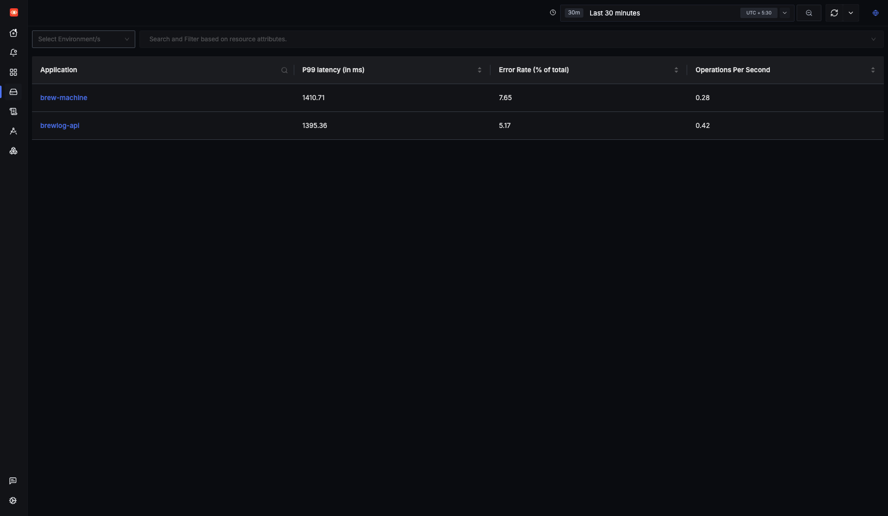
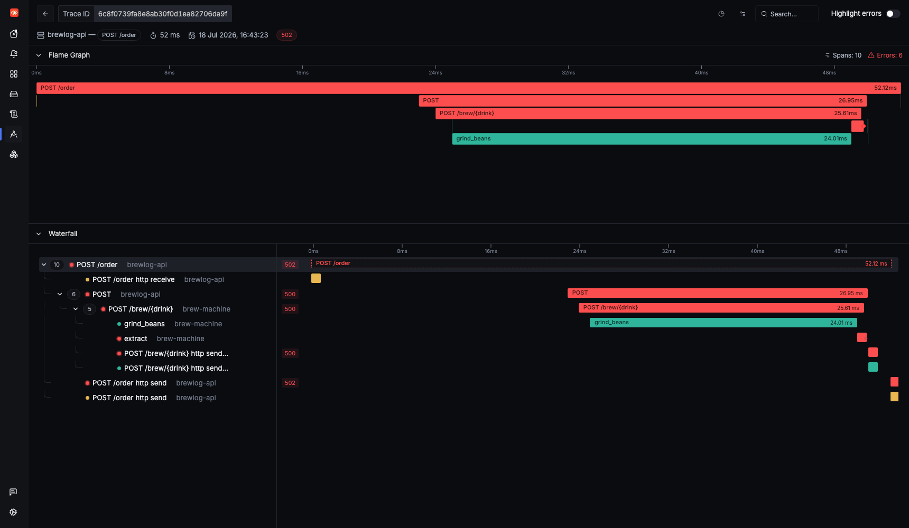
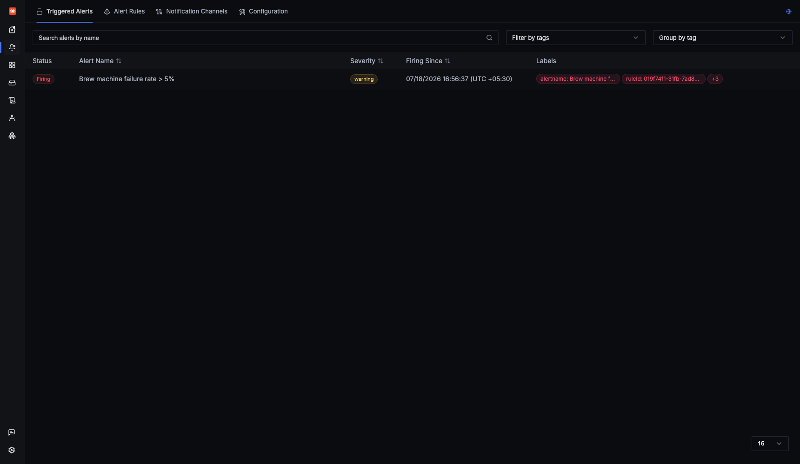
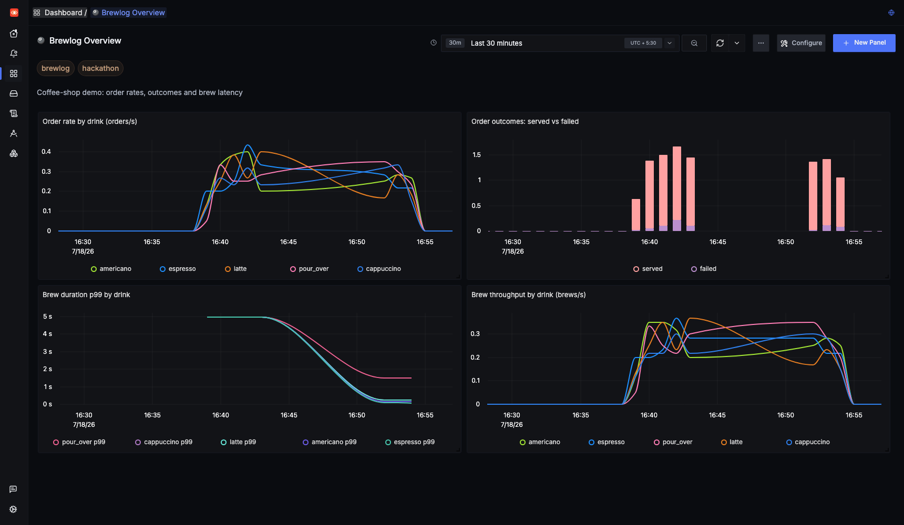

# Every container was "healthy". My traces went nowhere.

I self-hosted SigNoz for the Agents of SigNoz hackathon expecting a boring
docker-compose afternoon. Instead I learned that SigNoz's ingest ports don't
open until you create a user account, that the install path every tutorial
describes no longer exists, and that a histogram will happily tell you every
coffee takes 4.95 seconds to brew if you let it. This is a write-up of what
actually happened, on one MacBook, in one evening.

## What I was trying to do

The hackathon asks you to self-host SigNoz, point real telemetry at it, and
dig into the features. I didn't want to instrument a hello-world, so I built
**brewlog**: a small coffee-shop API in FastAPI, split into two services.
`brewlog-api` takes orders and calls `brew-machine` over HTTP, which "brews"
the drink. I added deliberate chaos: 8% of brews fail with a random "machine
jammed" error, and pour_over is intentionally ~10x slower than espresso so
there's a real p99 outlier to hunt. SQLite underneath, httpx between the
services. Boring on purpose, chaotic on purpose.

## Setup: your tutorial is lying to you

I don't run Docker Desktop, so first stop was Colima:

```bash
brew install colima docker docker-compose
colima start --cpu 4 --memory 8 --disk 60
```

One gotcha: Homebrew's compose is a CLI plugin, and `docker compose` won't
find it until you add this to `~/.docker/config.json`:

```json
{ "cliPluginsExtraDirs": ["/opt/homebrew/lib/docker/cli-plugins"] }
```

Then I cloned SigNoz and went looking for `deploy/docker/docker-compose.yaml`,
because that's what every blog post from the last three years says to do. It's
gone. The `deploy/` directory now contains a README politely telling you the
compose manifests are deprecated and SigNoz installs through **Foundry**, a
new CLI with full commitment to the metallurgy bit: you install `foundryctl`,
write a `casting.yaml`, run `foundryctl cast`, and the generated compose files
land in a directory called `pours/`.

```yaml
apiVersion: v1alpha1
kind: Installation
metadata:
  name: signoz
spec:
  deployment:
    flavor: compose
    mode: docker
  mcp:
    spec:
      enabled: true
```

That `mcp` block also gives you SigNoz's MCP server on port 8000, so AI agents
can query your telemetry. One `cast` later I had seven containers up: the
SigNoz server, an OpenTelemetry collector, ClickHouse, clickhouse-keeper, a
Postgres metastore, a migrator, and the MCP server. Everything reported
healthy. UI on localhost:8080. Great.

## The trap: ingestion is gated on signup, and nothing tells you

I wired the app up with OpenTelemetry auto-instrumentation and pointed it at
`localhost:4317`. Exports immediately died:

```
Transient error StatusCode.UNAVAILABLE encountered while exporting traces
to localhost:4317 ... Socket closed
```

Socket *closed*, not refused. Docker was accepting the connection and the
collector was hanging up. The collector container has no ps or netstat, so I
ended up reading `/proc/net/tcp` and converting hex ports by hand (4317 is
0x10DD, if you ever need this). Only the collector's pprof, internal metrics
and healthcheck ports were listening. No 4317, no 4318. And yet the generated
`ingester.yaml` clearly configures OTLP receivers on both.

The answer was in the SigNoz server logs, repeating every 30 seconds:

```
failed to find or create agent ... cannot create agent without orgId
```

The collector doesn't read its config file at startup. It connects to the
SigNoz server over **OpAMP** and receives its effective config remotely, and
the server refuses to register the agent until an organization exists, which
only happens when the first admin user signs up. So the entire ingest pipeline
is dead until you fill in the signup form. That ordering appears in no
install doc I could find. I registered a user, and about 30 seconds later the
OpAMP retry succeeded and both ports opened.

I get the design, config management from the control plane is how you do
managed pipelines, but "telemetry ports won't listen until first signup"
really deserves a line in the install guide.

## Instrumentation: the part that just worked

Credit where due, this was almost free:

```bash
pip install opentelemetry-distro opentelemetry-exporter-otlp
opentelemetry-bootstrap -a install
OTEL_SERVICE_NAME=brewlog-api opentelemetry-instrument uvicorn app:app --port 8001
```

FastAPI, httpx and sqlite3 all get traced with zero code changes, and trace
context propagates across the HTTP hop between my two services automatically.
I added maybe fifteen lines by hand: two custom spans (`grind_beans`,
`extract`), span attributes for the order id and drink, a counter and a
histogram, and this environment variable, which turned out to be my favorite
line of configuration in the whole project:

```bash
OTEL_PYTHON_LOGGING_AUTO_INSTRUMENTATION_ENABLED=true
```

That ships every ordinary `logging` call as an OTel log record, stamped with
the active trace and span IDs. No structured logging library, no JSON
formatter, nothing.



## The feature I keep coming back to: one click from a 502 to the log line

Here's the workflow that sold me. Traffic generator running, orders flowing,
and the Services page shows `brew-machine` sitting at a 7.65% error rate. I
open Traces, filter to errors, and pick a failed `POST /order`. The flame
graph shows the whole story in one screen: ten spans, two services, the
request crossing from `brewlog-api` into `brew-machine`, and at the bottom a
short red `extract` span where the machine jammed. The 500 bubbles up to the
api's outer span as a 502.



From that red span, "related logs" lands me on the exact
`machine jammed while brewing espresso` line, because the trace and span IDs
were already on the log record thanks to that one environment variable. The
reverse direction works too, log line back to full trace. I've done this
dance across three different tools before (metrics dashboard, tracing UI,
log aggregator, three tabs, three query languages). Having it inside one tool
with the join done for you is the thing I'd actually pay for.

I closed the loop with an alert: a threshold rule on
`(failed orders / total orders) * 100 > 5%`, which the 8% jam rate trips
reliably. The notification channel is a webhook pointing back at the demo app
itself, which logs the alert, which ships to SigNoz as a log. My observability
stack now complains about my coffee machine, to my coffee machine.



## Two more things that bit me

**Histograms don't lie, but buckets do.** My first p99-by-drink panel showed
every drink at exactly 4.95s. Espresso takes 50ms. The cause: OTel's default
histogram boundaries start at [0, 5, 10, ...], so every sub-second brew falls
into the (0, 5] bucket and quantile interpolation invents ~4.95s. The fix is
`explicit_bucket_boundaries_advisory=[0.025, ..., 3.0]` on the instrument. My
dashboard still shows the moment the fix deployed, a flat 4.95s line bending
down to reality, with pour_over settling at its true ~1.4s.



**The p99 query didn't error politely, it didn't work at all at first.**
ClickHouse said `Function with name 'histogramQuantile' does not exist`.
SigNoz ships that function as a custom UDF: a binary plus a YAML definition.
Foundry mounts the definition as `functions.yaml`, but ClickHouse's config
glob is `*function.yaml`, singular, so the file never matches and the UDF
never loads. Behind that was a second bug: the definition declares the
quantile argument as `Array(Float64)` while the generated SQL passes a scalar.
Renaming the file, fixing the type and running `SYSTEM RELOAD CONFIG` fixed
p99 queries for good. I'm filing both upstream against Foundry v0.2.14.

## What worked, what didn't

Worked: OTel auto-instrumentation was genuinely zero-code for my stack; the
trace-to-logs join is the best version of that workflow I've used; the v5
alert builder's multi-query formulas are more capable than I expected from a
self-hosted tool.

Didn't: the install docs lag the Foundry migration badly; ingestion silently
gated on signup cost me the most debugging time for the dumbest reason; the
UDF packaging bug means histogram quantiles are broken out of the box on a
fresh Foundry install.

All of this was one evening on an M-series MacBook with 16GB RAM under
Colima. Your setup will differ; the OpAMP behavior and the Foundry bugs
should reproduce anywhere.

## The one-liner

Self-hosting SigNoz is twenty minutes of casting containers and two hours of
spelunking, and the spelunking is where all the learning lives.

Code for brewlog is [here](LINK-YOUR-REPO), SigNoz docs are at
[signoz.io/docs](https://signoz.io/docs), OpenTelemetry Python at
[opentelemetry.io](https://opentelemetry.io/docs/languages/python/).

---
*(Dev.to tags: #signoz #opentelemetry #observability #devops)*
